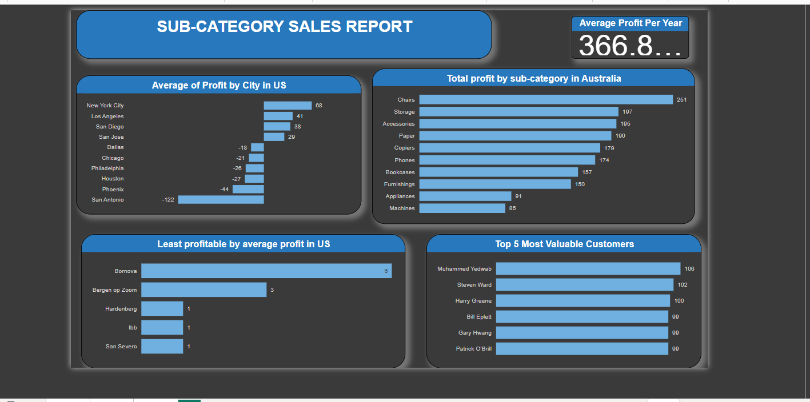

# GLOBALSTORE SALES REPORT

## INTRODUCTION

Global Superstore is a global online retailer based in New York, boasting a broad product catalog andaiming to be a one-stop-shop for its customers. Global The superstore’s clientele, hailing from 147different countries, can browse through an endless offering with more than 10,000 products. This large selection comprises three main categories: office supplies (e.g., staples), furniture (e.g., chairs), and technology (e.g., smartphones).

**_Disclaimer_**: _All datasets and reports do not represent any company,institution or country, but just a dummy dataset to demostrate capabilities of Power BI._

## POWER QUERY

Power Query is a valuable tool for data professionals and analysts who need to clean ,transform,and load data from different sources. power query made my work easier in preparing datasets for analysis and reporting.

## RAW DATA/ UNCLEAN DATASETS
After transforming and loading the datasets into power bi, The raw data such as errors, null, missing values ,inconsistencies, and the need for cleaning to make it usable for analysis.Literally without cleaning the datasets will be useless and it will not give the specfic figures or values we are looking for.

## CLEAN DATASETS
When i talk about clean data ,i mean data that has been processed and prepared to be accurate ,consistent , and free of errors ,nulls. cleaning data involves tasks like removing duplicates,handling, missing values,correcting error and standardizing formats. By cleaning the data , i make sure that it is in a suitable condition for analysis ,visualization,and reporting.

## PROBLEM STATEMENT

### Question 1 
a) What are the three countries that generated the highest total profit for Global Superstore in 2014?
b) For each of these three countries, find the three products with the highest total profit. Specifically,
what are the products’ names and the total profit for each product?

### Question 2 
a) Identify the 3 subcategories with the highest average shipping cost in the United States?

### Question 3
a) Assess Nigeria’s profitability (i.e., total profit) for 2014. How does it compare to other African
countries?

b) What factors might be responsible for Nigeria’s poor performance? You might want to investigate
shipping costs and the average discount as potential root causes.

### Question 4
a) Identify the product subcategory that is the least profitable in Southeast Asia.
Note: For this question, assume that Southeast Asia comprises Cambodia, Indonesia, Malaysia, Myanmar
(Burma), the Philippines, Singapore, Thailand, and Vietnam.
b) Is there a specific country i n Southeast Asia where Global Superstore should stop offering the
subcategory identified in 4a?

### Question 5
a) Which city is the least profitable (in terms of average profit) in the United States? For this analysis,
discard the cities with less than 10 Orders. b) Why is this city’s average profit so low?

### Question 6
a) Which product subcategory has the highest average profit in Australia?

### Question 7
a)Who are the most valuable customers and what do they purchase?

## SKILLS/CONCEPT DEMONSTRATED
The following power BI features were incorporated:
- Bookmarking,
- Dax,
- Quick measures,
- Page navigation,
- Modelling,
- Filters,
- Tooltips,
- Button.

## MODELING
Modeling involves the metrics used to evaluate the model's performance,and any challenges  encountered during the modeling process and also it plays a crucial role in connecting different tables with in the data model in Power BI.in this the relationships are not much,The model is a star schema.

## VISUALISATION/REPORTING
 The report conprises 3 pages
 1. Globalstore report
 2. Nigeria compared to other Africa countries
 3. Sub-category sales report.
    
**_ Note**_: I'm unable to add link for interaction of dashboard in power BI,because i do not have an organisational email to sign in power BI.

## INSIGHT/FINDING
- Total profit which is 1.47M
- Total sales which is 12.64M
- Total Quantity which is 178K
- Average profit per year 366.86K
- The highest sub-categoryby profit is chair and count of country 251 🙂
- Most profitable countries in 2014 are (United state , China ,India).
- Country Globalstore should stop offering sub-category in South Asia are (Indonesia, Thailand).
  
  ## RECOMMENDATION
 For a deep drive into the analytics , the datasets of the previous years will be required for comparison and data driven decision making. 

